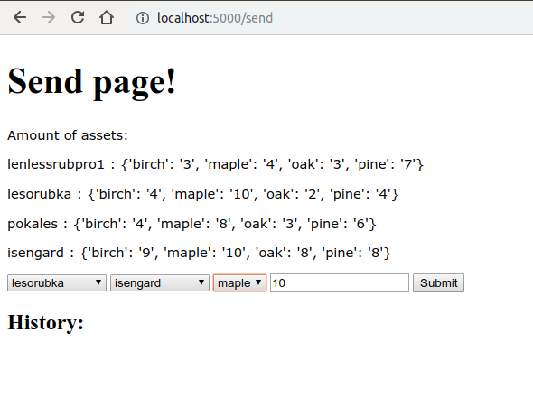

Iroha Python Demo


******
Simple demonstration of iroha app with GUI

This example was created for the `Basics of Grid and Cloud Computing` course.

### How to deploy
* clone this repo: `git clone https://github.com/andrcrus/Iroha-Python-Demo.git`
* install python requirements: `pip install -r requirements.txt`
Run `start_ledger.sh` to start Docker container with Iroha ([Iroha docs](https://iroha.readthedocs.io/en/latest/getting_started/index.html))
* Execute this command inside container:
```sh
irohad --config config.docker --genesis_block genesis.block --keypair_name node0 --overwrite_ledger
```
*Tip:* You can restart and recreate ledger with run restart_and_recreate_ledger.sh
* python3.6 ./src/python/main.py
This command initializes a ledger, creates 10000/len(sawmills) (4 by default) pieces of wood for admin, gives out random amount of wood to every sawmill. Name and amount of wood and sawmills can be changed by editing src/python/config.py. 

API description and examples:
*API:
* GET /admin_details
* GET /acc/<account>
* GET /send
* POST /send

### Screenshots:





***
*LOG:

```
Transaction hash = b'd77eeff72ef3487630506efeda9f3599d769d8fbd65eaf9a7f4208616caf7309', creator = admin@test
\[('ENOUGH_SIGNATURES_COLLECTED', 9, 0), ('STATEFUL_VALIDATION_SUCCESS', 3, 0), ('COMMITTED', 5, 0)]
admin details...
Transaction hash = b'097eb7f95772b61258b1f6ae7d6998b5790d376f6954de6b093c0d542120162a', creator = admin@test
\[('ENOUGH_SIGNATURES_COLLECTED', 9, 0), ('STATEFUL_VALIDATION_SUCCESS', 3, 0), ('COMMITTED', 5, 0)]
admin details...
Asset id = birch#sawmill, balance = 2500
Asset id = oak#sawmill, balance = 2500
Asset id = pine#sawmill, balance = 2500
Asset id = maple#sawmill, balance = 2500
init ledger...
Transaction hash = b'bc233219159d28ed21acd5c4f073131497d1e0cc44c7768ceae8e693127fbfcd', creator = admin@test
[('ENOUGH_SIGNATURES_COLLECTED', 9, 0), ('STATEFUL_VALIDATION_SUCCESS', 3, 0), ('COMMITTED', 5, 0)]
====================
Transaction hash = b'd12d0ccbfc9d4501df249768cf04ada7389eece2ecbc700f92a1c53a1f53a5c8', creator = admin@test
[('ENOUGH_SIGNATURES_COLLECTED', 9, 0), ('STATEFUL_VALIDATION_SUCCESS', 3, 0), ('COMMITTED', 5, 0)]
admin details...
Asset id = birch#sawmill, balance = 2280
Asset id = oak#sawmill, balance = 2208
Asset id = pine#sawmill, balance = 2257
Asset id = maple#sawmill, balance = 2324
{'lenlessrubpro1': {'birch': '18', 'oak': '91', 'pine': '71', 'maple': '35'}, 'lesorubka': {'birch': '75', 'oak': '97', 'pine': '30', 'maple': '23'}, 'pokales': {'birch': '47', 'oak': '38', 'pine': '63', 'maple': '72'}, 'isengard': {'birch': '80', 'oak': '66', 'pine': '79', 'maple': '46'}}
====================
 * Serving Flask app "main" (lazy loading)
 * Environment: production
   WARNING: Do not use the development server in a production environment.
   Use a production WSGI server instead.
 * Debug mode: off
 * Running on http://0.0.0.0:5000/ (Press CTRL+C to quit)
127.0.0.1 - - [01/Apr/2019 22:30:11] "GET /send HTTP/1.1" 200 -
Transaction hash = b'82c803752ea16c8bd3128c78d8133e3df26580fd13e381c0fda22fe99a3837bb', creator = lenlessrubpro1@sawmill
127.0.0.1 - - [01/Apr/2019 22:30:24] "POST /send HTTP/1.1" 200 -
127.0.0.1 - - [01/Apr/2019 22:30:25] "GET /send HTTP/1.1" 200 -
127.0.0.1 - - [01/Apr/2019 22:30:31] "POST /send HTTP/1.1" 403 -
127.0.0.1 - - [01/Apr/2019 22:30:33] "GET /send HTTP/1.1" 200 -
127.0.0.1 - - [01/Apr/2019 22:30:41] "POST /send HTTP/1.1" 403 -
127.0.0.1 - - [01/Apr/2019 22:30:43] "GET /send HTTP/1.1" 200 -
127.0.0.1 - - [01/Apr/2019 22:30:47] "POST /send HTTP/1.1" 403 -
127.0.0.1 - - [01/Apr/2019 22:30:48] "GET /send HTTP/1.1" 200 -
127.0.0.1 - - [01/Apr/2019 22:30:55] "POST /send HTTP/1.1" 403 -
127.0.0.1 - - [01/Apr/2019 22:30:58] "GET /send HTTP/1.1" 200 -
127.0.0.1 - - [01/Apr/2019 22:31:05] "GET /acc/isengard HTTP/1.1" 200 -
127.0.0.1 - - [01/Apr/2019 22:31:10] "GET /send HTTP/1.1" 200 -
Transaction hash = b'a6db3788998277412e145e9de35caee83c526aa145306c5d58b685c5263cdcd0', creator = pokales@sawmill
127.0.0.1 - - [01/Apr/2019 22:31:24] "POST /send HTTP/1.1" 200 -
127.0.0.1 - - [01/Apr/2019 22:31:25] "GET /send HTTP/1.1" 200 -
```